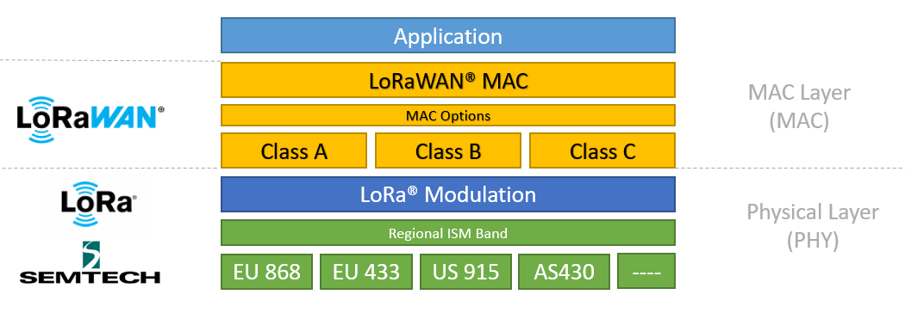

# Localization-based-on-LoRaWAN-Network
**My bachelor project at AmirKabir University of Technology**. This is an IOT project based on LoRaWAN Communication Network that includes designing boards and Hardware, microcontroller programming, AI and data gathering. 
In this project I'm setting up a LoRaWAN hardware infrastructure including LoRa Node and 3 Gateway, then I will gather RSSI(Receieved Signal Strength Indicator) data in a chosen location. At the end I am going to work on the gathered datasetin the campus from 3 LoRaWAN gateways.

## Table of content
    - LPWAN Technologies and LoRaWAN
    - Project Introduction
        - Localization
        - Test Space
        - LoRa Gateway
        - Making LoRa Node
    - Gathering dataset
    - Pre-proccessing and filtering data

## LPWAN Technologies and LoRaWAN
Communication technologies are essential for enabling the exchange of data and information in various applications, and one emerging technology that has garnered significant attention is Low Power Wide Area Network (LPWAN). LPWAN is a wireless communication technology designed to provide long-range connectivity with low power consumption, making it ideal for the Internet of Things (IoT) and other applications.

LPWAN technologies, such as LoRaWAN and Sigfox, stand out due to their ability to transmit data over long distances, often spanning several kilometers, while requiring minimal power. This extended range makes LPWAN suitable for applications like smart cities, agriculture, asset tracking, and environmental monitoring, where devices may be located far from traditional network infrastructure.

One of the key advantages of LPWAN is its cost-effectiveness, as it allows for the deployment of a large number of low-power devices over a wide area without the need for frequent battery replacements. LPWAN technologies achieve this by utilizing unlicensed spectrum bands and optimizing data transmission protocols for minimal energy consumption. As a result, LPWAN is facilitating the growth of IoT by enabling the connection of devices in remote or challenging environments, where traditional cellular or Wi-Fi connectivity may not be practical or cost-effective.

As you can see in the picture below, this visual comparison chart provides a clear overview of multiple communication technologies, including WiFi, LPWAN (Low Power Wide Area Network), Bluetooth, Cellular, and others. It focuses on four critical factors: range, cost, data rate, and power consumption. This chart serves as a valuable reference, allowing users to quickly assess the strengths and trade-offs of each technology. Whether your project demands long-range capabilities, cost-effectiveness, high data rates, or efficient power consumption, this image aids in making well-informed decisions when selecting the most suitable communication solution.

In this project we chosed LoRaWAN technology mainly beacuse we wanted to exmine it's pros and cons and also we waned to develop an important application using LoRaWAN which is Localization. Also it was a cheap and available option :). You can see the tech stack of LoRaWAN in the picture below

## Project Introduction
The Aim of this project is to utilize LoRaWAN technology and Machine Learning approaches to develop an application that can localize an end-device using RSSI measurments. 
**How it works:** The data-set of RSSI measures are going to be fed into some AI machine learning algorithms. these algorithms helps us to locate the approximate position of the end-device in the mentioned area.

**Used Algorithms:**
Supervised:
1. KNN
2. SVM
3. MLP
4. XGBoost

Unsupervised:
1. Kmeans
2. Fuzzy clustering

### Localization
**Localization**, also known as positioning, refers to the process of determining and describing the location or position of an object, person, or device within a defined space, often using coordinates or relative references. This concept finds extensive applications in various fields, from global positioning systems (GPS) for navigation to indoor positioning systems in smart buildings. Localization relies on a combination of technologies such as satellite signals, radio waves, sensors, and algorithms to accurately pinpoint the position of the target entity.

In technology, GPS is a prime example of localization, allowing users to determine their precise geographic coordinates using signals from a network of satellites. Within the context of robotics and autonomous vehicles, localization is essential for ensuring accurate navigation and obstacle avoidance. In indoor environments, beacons, Wi-Fi signals, and sensor networks are often employed for localization, enabling applications like asset tracking and indoor wayfinding. Localization also plays a crucial role in augmented reality (AR) and virtual reality (VR) experiences, where the position of a user's device or headset relative to the environment is essential for rendering digital content seamlessly.

Overall, localization is a fundamental technology that underpins many modern applications, enabling us to understand and interact with our physical surroundings and digital environments more effectively. Its importance continues to grow as our reliance on precise positioning information expands in an increasingly connected and automated world.

**Localization using RSSI Measurements**
Localization based on Received Signal Strength Indicator (RSSI) measurements is a technique that leverages radio signal strength to estimate the location of a device. RSSI is a valuable tool for indoor positioning systems, especially in environments where GPS signals are weak or unavailable.

In this approach, multiple fixed reference points with known locations are equipped with transmitters, emitting signals detected by the mobile device. By measuring the RSSI of these signals, the device can estimate its proximity to each reference point. Trilateration or fingerprinting algorithms are commonly used to calculate the device's position relative to the reference points. While effective, RSSI-based localization may be susceptible to interference and signal variations, requiring careful calibration and signal processing for accurate results.

### Test Space
In this project I'm using 3 gateways. as you can see in the following picture, the covered area is in the form of a triangle with an approximate area of 12 square kilometers.

As I've said the goal of this project is to develope a system for localization based on LoRaWAN infrastructure. So, first of all we need to setup a LoRaWAN network using Gateways

The gateways where placed in:
    - Computer Engineering Department
    - Civil Faculty
    - mining Engineering Department

### LoRa Gateway

To build a LoRaWAN gateway, first we need a LoRaWAN radio module that plays the role of receiving and sending radio signals between the Platform and end-devices. I used RAK831 8-channel

After that, we need a piece of hardware capable of running an operating system. For this purpose, we use a Raspberry pi small computer. At the end we are going to need an anthena with the right frequency (in this case 915MHz).

You can see one of the gateways i made in the following picture

### LoRa Node
after setting up the network I used a LoRa end-device node, that I have built to gather data and to create a data-set. The end-device is shown in the picture below. the end device contains from 5 main parts:

1. Proccessor: arduino pro mini
2. LoRa phy layer: LoRa Hope
3. Power source: 1 cell of lithium polymer battery with 1000mah
4. Antena: 915Mhz antena and an antena conector (the yellow connector between antena and the pcb in the picture below).
5. Main pcb: this pcb is an interface to connect proccessor and LoRa module in a sufficent way. I used the following github link for the pcb https://github.com/CongducPham/LowCostLoRaGw

### Gathering dataset
ِData are discrete numbers in range of -30 to -120. These numbers indicates the strength of a received signal from the end-device to the Gateway. The more negative the RSSI of a signal is, the weaker it is. in the data-set -120 means the signal never reached the gateway.

In order to gather data, I Divided the covered area into 7 regions as shown in the image below. this regions are used as the ground-truth for the supervised learning techniques.

Feel free to see gathered data set in data-set folder

### Pre-proccessing and filtering data
I am using a simple version of kalman filter name α−β−γ to filter the data. the reason behind it is that, the RSSI values are very noisy and affected by a lot of noises in the environment. so we use filters to minimise the effect of noises on the data.

I used the following equation to filter the data:

- x is the true value of the weight
- zn is the measured value of the weight at time n
- x^n,n is the estimate of x at time n (the estimate is made after taking the measurement zn)
- x^n+1,n is the estimate of the future state (n+1) of x. The estimate is made at the time n. In other words, x^n+1,n is a predicted state or extrapolated state
- x^n,n−1 is a prior prediction - the estimate of the state at time n. The estimate is made at the time n−1
- The term (zn − x^n,n−1) is the "measurement residual," also called innovation. The innovation contains new information.

In this example, 1/n decreases as n increases. In the beginning, we don't have enough information about the current state; thus, the first estimation is based on the first measurement 1/n|n=1 = 1

As we continue, each successive measurement has less weight in the estimation process, since 1/n decreases. At some point, the contribution of the new measurements will become negligible.

source: https://www.kalmanfilter.net/background.html

The schematic of the filter used is as follows:

